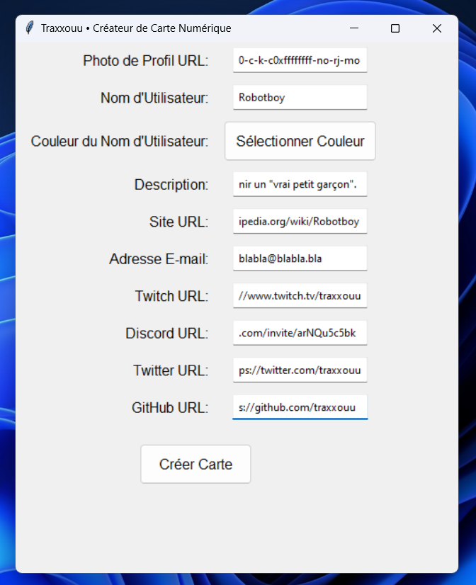
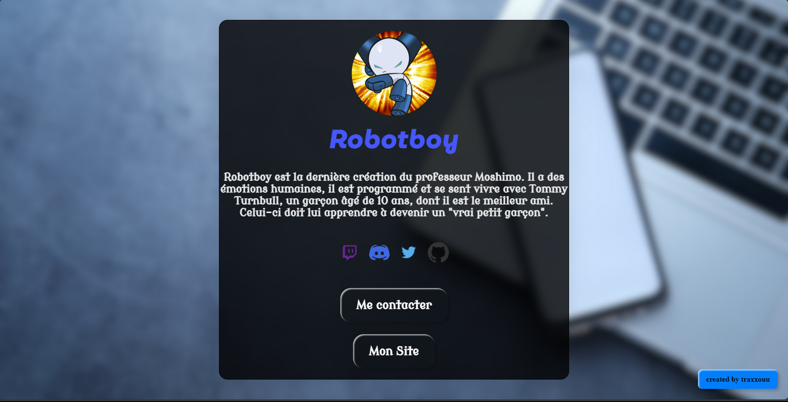

# Créateur de Carte Numérique

Bienvenue dans le Créateur de Carte Numérique ! Cette application légère et intuitive vous permet de générer des cartes numériques personnalisées avec facilité.

## Fonctionnalités

- **Personnalisation Facile** : Choisissez votre photo de profil, la couleur de votre nom d'utilisateur et saisissez des détails personnels pour créer une carte unique.

- **Intégration de Réseaux Sociaux** : Ajoutez des liens vers vos profils Twitch, Discord, Twitter, GitHub, et d'autres pour faciliter la connexion avec votre communauté.

- **Aperçu en Temps Réel** : Visualisez instantanément l'apparence de votre carte pendant que vous faites les modifications.

- **Génération de Code HTML** : Exportez automatiquement le code HTML de votre carte prête à être partagée en ligne.

## Comment Utiliser l'Application

1. **Ajouter des Informations** :
   - Saisissez votre photo de profil, nom d'utilisateur, couleur, description, et liens vers vos réseaux sociaux.

2. **Personnaliser la Couleur** :
   - Utilisez le bouton "Sélectionner Couleur" pour choisir la couleur de votre nom d'utilisateur.

3. **Générer la Carte** :
   - Cliquez sur "Créer Carte" pour générer le fichier HTML de votre carte.

4. **Visualiser et Partager** :
   - Ouvrez le fichier 'index.html' généré pour visualiser votre carte et partagez-la en ligne.

## Captures d'écran

**Exemple de Carte Générée**

## Netlify
**➡️Utilisez netlify pour deployer votre carte numérique.** 
1. **Créer un dossier**
   - Vous devez tout d'abord creer un dossier contenant le fichier *style.css* ; le fichier qui vient d'être généré *index.html* et le dossier *media*.
      - 

2. **Netlify**
   - Rendez-vous sur le site https://netlify.app/ ➡️ inscrivez-vous/connectez-vous et cliquez sur "Add new site" puis sur "Deploy manually".
      - 

3. **Drag n Drop**
   - Ensuite prendre le dossier contenant le fichier *style.css* ; le fichier qui vient d'être généré *index.html* ainsi que le dossier media puis le drag n drop dans netlify 
      - 
    
4. **Récupérer le lien**
   - Rendez-vous dans "Site configuration"
      - 
      -  vous pouvez modifier le lien

5. **Et voilà**
   - Bravo vous avez votre propre carte numérique
      - 

#
Profitez de la création de vos cartes numériques uniques avec cette application conviviale ! N'hésitez pas à contribuer, signaler des problèmes ou proposer des améliorations.
